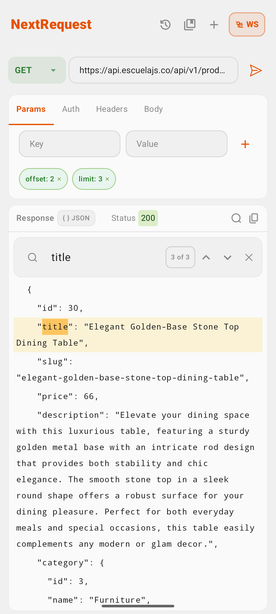
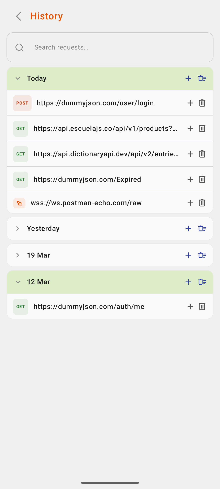
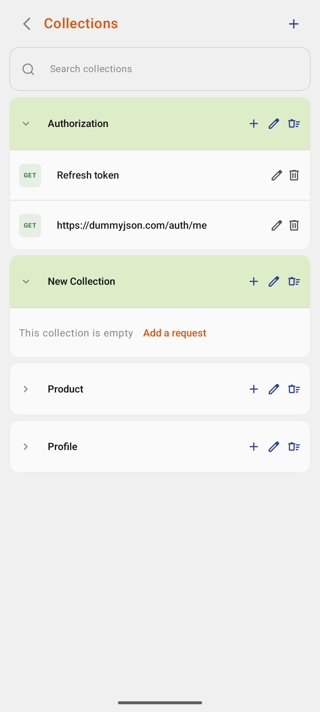

# NextRequest
A Postman-inspired API client for executing requests and inspecting responses.

## 📱 Pages
- **Home:** Execute API requests
- **History:** Review and reuse past requests
- **Collections:** Organize requests into custom groups

## 🛠 Technology
- **Architecture:** MVVM
- **UI:** Jetpack Compose
- **Database:** Room
- **Testing:** JUnit
- **Project Structure:** Package by features

## 📷 Screenshots

  
  
  

