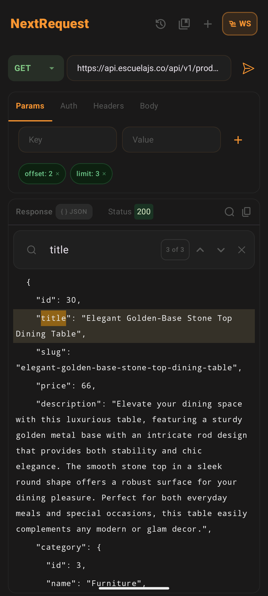
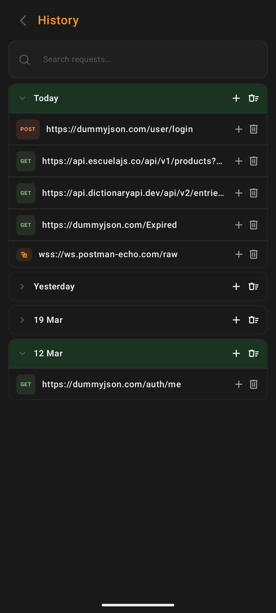
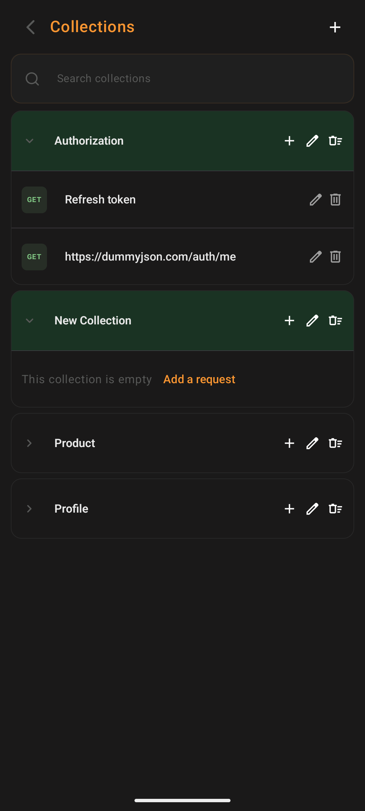
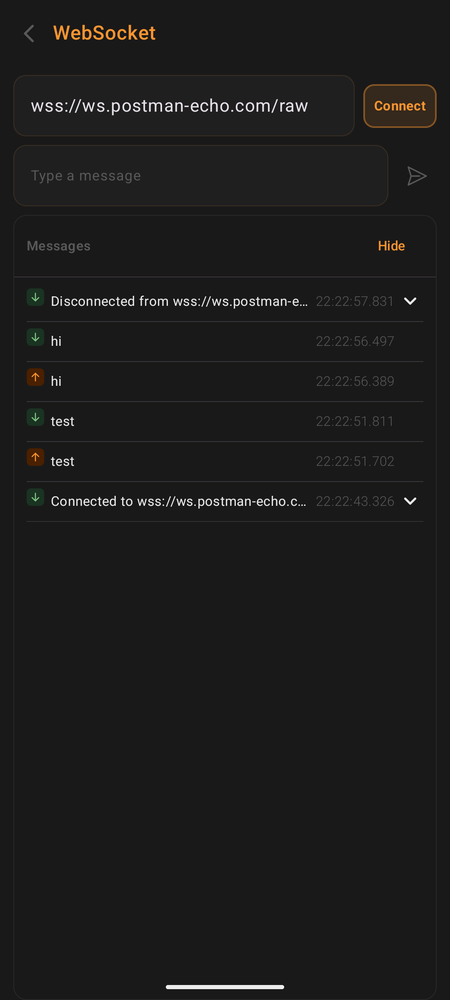
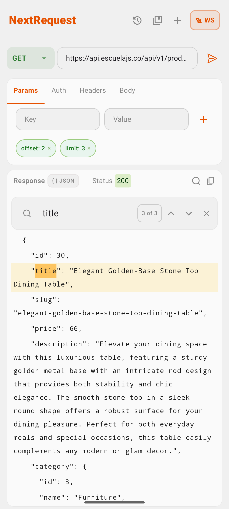
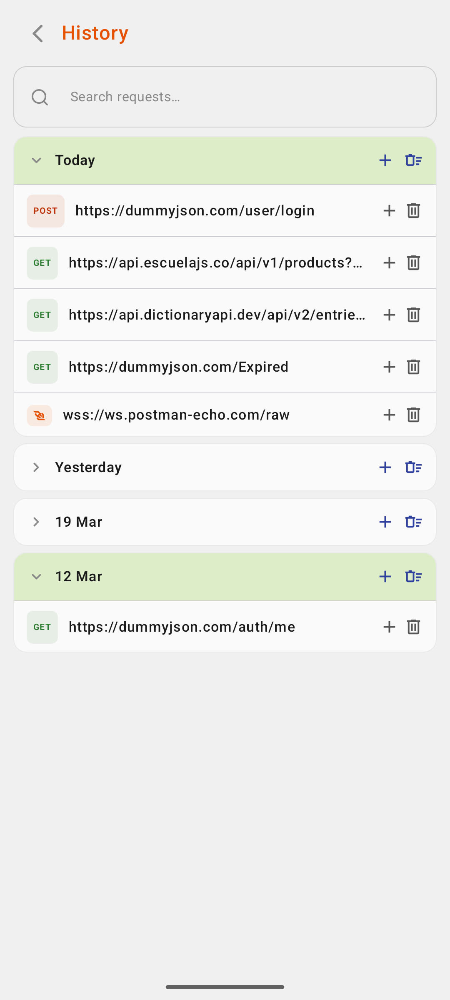
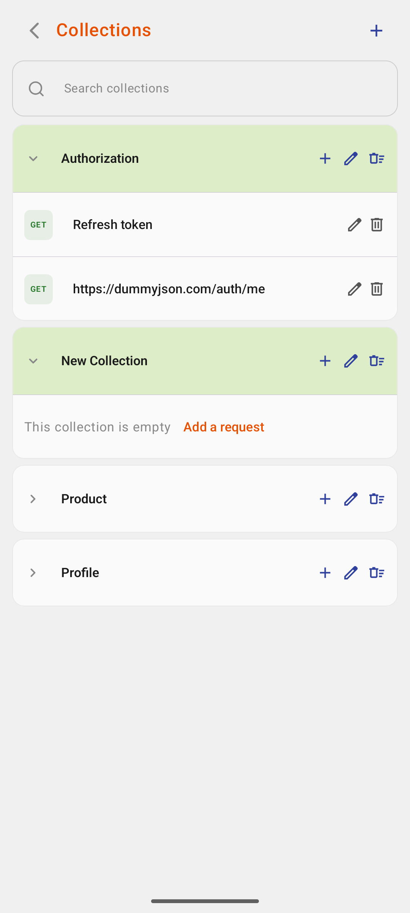
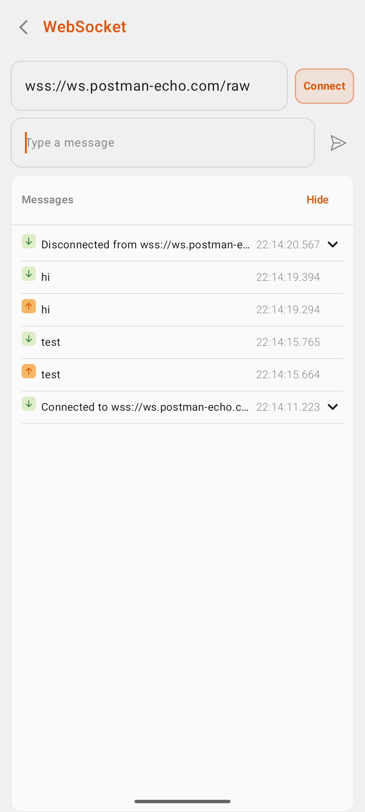

# NextRequest

A Postman-inspired API client for executing requests and inspecting responses.

## 📲 Download

Download the app on Google Play:

## ✨ Features

- 🚀 **Execute API Requests**  
  Send HTTP requests and inspect responses in real time.

- 🕘 **Request History**  
  View, reuse, and manage previously executed requests.

- 📁 **Collections**  
  Organize requests into custom groups for better workflow management.

## 🛠 Technology

- **Architecture:** MVVM  
- **UI:** Jetpack Compose  
- **Database:** Room  
- **Testing:** JUnit  
- **Project Structure:** Package by features

## 📷 Screenshots

  
  
  
  

  
  
  
  

